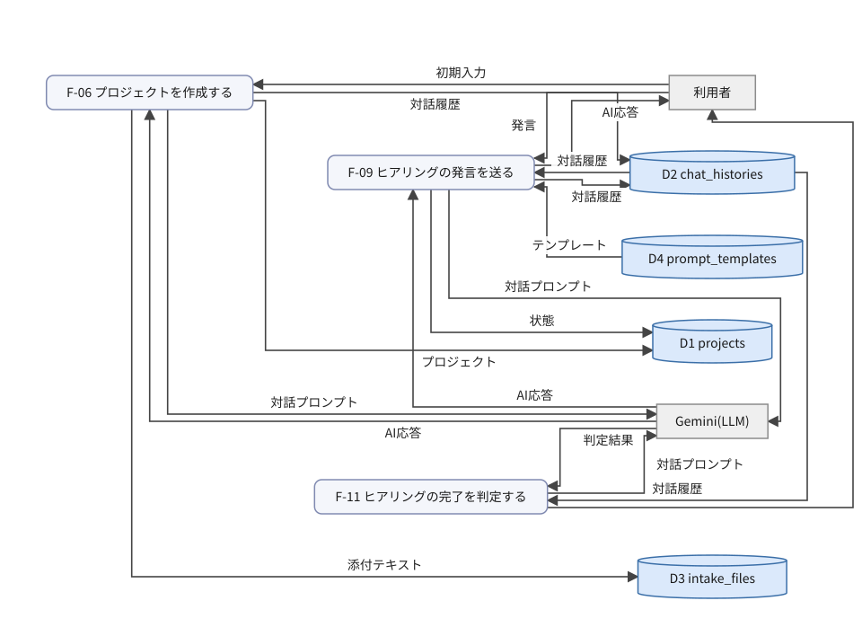
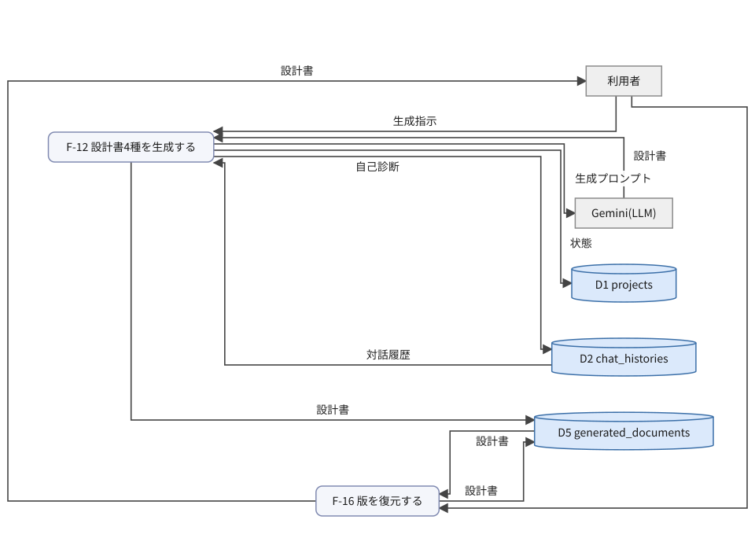
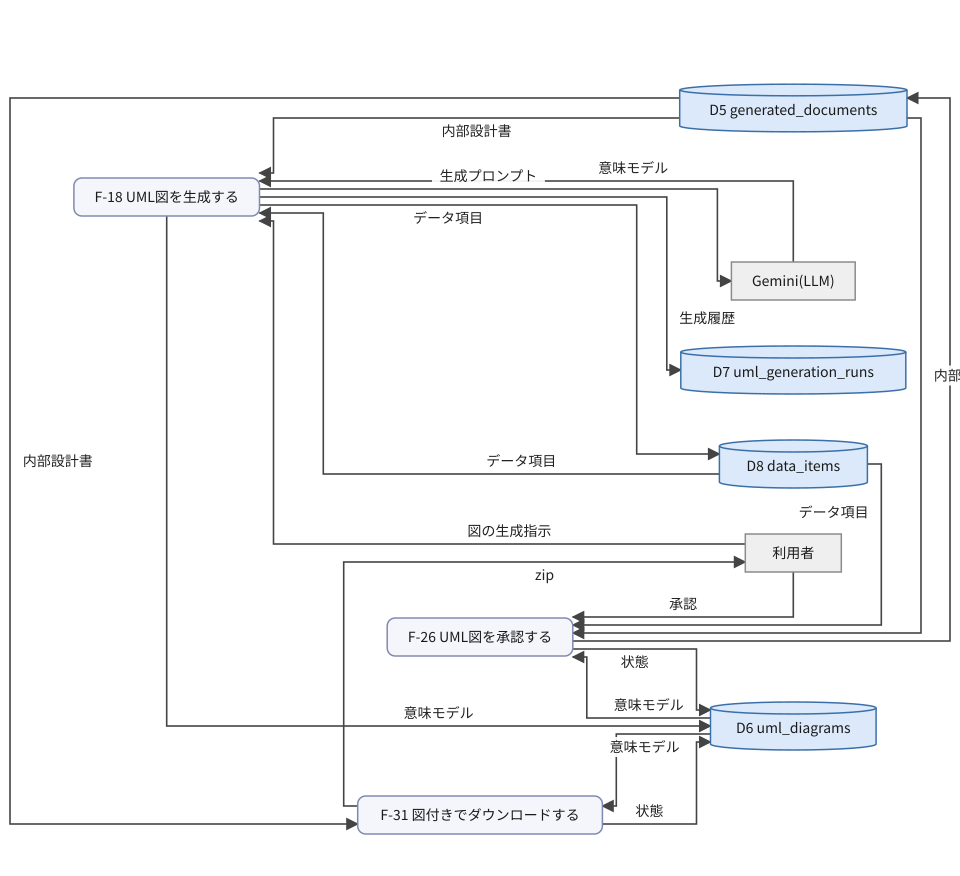
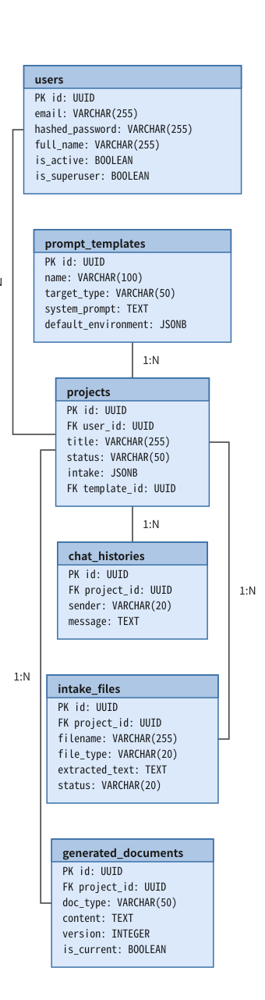
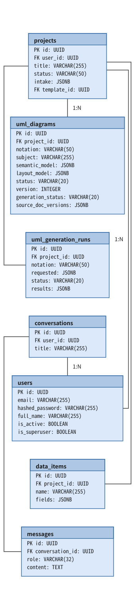
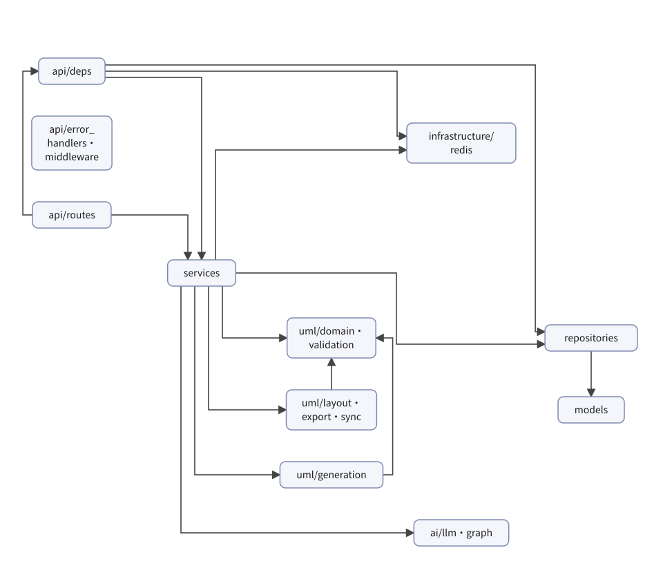

# Devex 詳細設計書(詳細設計モードの出力見本)

devex(013bd88)・devex-api stage3(46c0039)・devex-ui(9bea340)のコードから作成。2026-09-30

> 詳細設計モード(ステージ4)が段階1〜6を承認した後に組み立てる詳細設計書の見本。Devex 自身を題材に、実際のコードから起こした。読むための形式は detailed-design.html。この md はリンクを持たず、ID を本文に書く(差分・AI への入力用)。

## 01 機能(処理)一覧

| 処理ID | 名称 | 種別 | トリガー | 関連画面 | グループの初期値 | 機能グループ | 概要 |
|---|---|---|---|---|---|---|---|
| F-01 | 利用者を登録する | API | POST /api/v1/auth/register | SCR-001 | auth | 認証 | IP 単位のレート制限の後、メールの重複を確かめて利用者を作る |
| F-02 | ログインする | API | POST /api/v1/auth/login | SCR-001 | auth | 認証 | IP・メール単位のレート制限の後に認証し、access を本文、refresh を httpOnly Cookie で返す |
| F-03 | access を更新する | API | POST /api/v1/auth/refresh | —(自動) | auth | 認証 | Cookie の refresh を検証し(Redis に jti が残っているか)、新しい access を返す |
| F-04 | ログアウトする | API | POST /api/v1/auth/logout | 全画面 | auth | 認証 | Redis の jti と Cookie を消す |
| F-05 | 自分の情報を返す | API | GET /api/v1/users/me | 全画面 | users | 認証 | 認証済みの利用者を返す |
| F-06 | プロジェクトを作成する | API | POST /api/v1/projects | SCR-003/004 | projects | プロジェクト・ヒアリング | 初期入力と添付(最大3件、txt/md/pdf)を保存し、AI の最初の発話を作る(失敗しても作成は成功) |
| F-07 | プロジェクト一覧を返す | API | GET /api/v1/projects | SCR-002 | projects | プロジェクト・ヒアリング | 利用者のプロジェクトを返す |
| F-08 | プロジェクトの詳細を返す | API | GET /api/v1/projects/{id} | SCR-004/005 | projects | プロジェクト・ヒアリング | 状態・初期入力・添付の要約を返す |
| F-09 | ヒアリングの発言を送る | API | POST /api/v1/projects/{id}/chat | SCR-004 | projects | プロジェクト・ヒアリング | 発言を受け、AI の応答を SSE で流す。completed なら revising にする |
| F-10 | ヒアリングの履歴を返す | API | GET /api/v1/projects/{id}/chat | SCR-004 | projects | プロジェクト・ヒアリング | 対話の履歴を古い順に返す |
| F-11 | ヒアリングの完了を判定する | API | GET /api/v1/projects/{id}/hearing-completion | SCR-004 | projects | プロジェクト・ヒアリング | 5条件を LLM の構造化出力で判定する。利用者の発言が3回未満なら不十分に補正 |
| F-12 | 設計書4種を生成する | API+バッチ | POST /api/v1/projects/{id}/generate(BackgroundTasks) | SCR-004/005 | projects | 文書 | 202 で受け付け、裏で4文書を連鎖生成し、自己診断を記録する |
| F-13 | 表示中の設計書を返す | API | GET /api/v1/projects/{id}/documents | SCR-005 | documents | 文書 | 文書の種類ごとに is_current の版を返す |
| F-14 | 設計書をダウンロードする | API | GET /api/v1/projects/{id}/documents/{doc_id}/download | SCR-005 | documents | 文書 | 1文書を Markdown で返す |
| F-15 | 版の一覧を返す | API | GET /api/v1/projects/{id}/documents/{doc_type}/versions | SCR-006 | documents | 文書 | 保持している版(最大3件)を返す |
| F-16 | 版を復元する | API | POST /api/v1/projects/{id}/documents/{doc_type}/versions/{version}/restore | SCR-006 | documents | 文書 | 表示する版(is_current)を切り替える。新しい版は作らない |
| F-17 | テンプレート一覧を返す | API | GET /api/v1/prompt-templates | SCR-003 | prompt-templates | テンプレート | 固定のシードデータを返す |
| F-18 | UML図を生成する | API+バッチ | POST /api/v1/projects/{id}/uml/diagrams(BackgroundTasks) | SCR-007 | uml | UML図 | 対象を検証して 202 で受け付け、裏で1件ずつ構造化出力で生成する |
| F-19 | UML図の一覧を返す | API | GET …/uml/diagrams | SCR-007 | uml | UML図 | 生成状態のポーリングにも使う |
| F-20 | 生成対象の候補を返す | API | GET …/uml/candidates | SCR-007 | uml | UML図 | 内部設計書の見出しから DFD の処理・ER のテーブルを列挙する(LLM なし) |
| F-21 | 生成履歴を返す | API | GET …/uml/generation-runs | SCR-007 | uml | UML図 | 対象ごとの結果と止まった理由を返す |
| F-22 | UML図を返す | API | GET …/uml/diagrams/{diagram_id} | SCR-007 | uml | UML図 | 意味モデル・座標・状態を返す |
| F-23 | UML図を保存する | API | PUT …/uml/diagrams/{diagram_id} | SCR-007 | uml | UML図 | version で楽観ロックし、意味モデルと座標を保存する。reviewing になる |
| F-24 | UML図を検証する | API | POST …/uml/diagrams/{diagram_id}/validate | SCR-007 | uml | UML図 | 構造と DFD 規則を検証する(常に 200) |
| F-25 | 自動レイアウトする | API | POST …/uml/diagrams/{diagram_id}/layout | SCR-007 | uml | UML図 | 30件以下・検証エラーなしのときに座標を計算する(別スレッド) |
| F-26 | UML図を承認する | API | POST …/uml/diagrams/{diagram_id}/approve | SCR-007 | uml | UML図 | 5条件を満たせば approved にし、同じトランザクションで内部設計書へ要素表を反映する |
| F-27 | draw.io で出力する | API | GET …/uml/diagrams/{diagram_id}/export/drawio | SCR-007 | uml | UML図 | 承認済みの図を .drawio で返し、exported にする |
| F-28 | SVG で出力する | API | GET …/uml/diagrams/{diagram_id}/export/svg | SCR-007 | uml | UML図 | 承認済みの図を SVG で返し、exported にする |
| F-29 | 図を再反映する | API | POST …/uml/reflect | SCR-005 | uml | UML図 | 承認済みの図すべてを表示中の内部設計書へ反映し直す |
| F-30 | 差し込む図と食い違いを返す | API | GET …/uml/embeds | SCR-005 | uml | UML図 | 承認済みの図の SVG と、図・文書の陳腐化の状態を返す |
| F-31 | 図付きでダウンロードする | API | GET …/uml/bundle | SCR-005 | uml | UML図 | 内部設計書の md と反映済みの図の zip を返し、図を exported にする |
| F-32 | データ辞書を返す | API | GET …/uml/data-items | SCR-007 | uml | データ辞書 | プロジェクト共通のデータ項目を返す |
| F-33 | データ項目を作る | API | POST …/uml/data-items | SCR-007 | uml | データ辞書 | 名前の重複は 409 |
| F-34 | データ項目を更新する | API | PUT …/uml/data-items/{item_id} | SCR-007 | uml | データ辞書 | 名前とフィールドを更新する |
| F-35 | データ項目を削除する | API | DELETE …/uml/data-items/{item_id} | SCR-007 | uml | データ辞書 | 204 を返す |
| F-36 | 汎用チャット(デモ) | API | POST /api/v1/chat | — | chat | 運用・デモ | テンプレート由来の LangGraph デモ。利用者ごとに 20回/時・100回/日 |
| F-37 | 死活を返す | API | GET /health | — | health | 運用・デモ | DB と Redis の状態を返す |

機能グループは、API のパスのリソース名(`/api/v1/<リソース>`、プロジェクト配下は `/projects/{id}/<リソース>`)から初期値を決定的に作り、人が確定した(決定#3)。`/projects/{id}/generate` は初期値が projects だが、生成物が文書なので「文書」に移した。`/uml/data-items` は初期値が uml だが、図とは独立に管理するので「データ辞書」に分けた。

## 02 データフロー

重要な部分だけ: DFD はコアループ(プロジェクト・ヒアリング、文書)と UML 図の3つの機能グループだけ描く。UML 図の DFD も、生成・承認・出力に絞った(保存 F-23・自動レイアウト F-25 は単純な読み書き)。認証・テンプレート・データ辞書・運用は、単純な読み書きなので処理概要表の行で済ませる。

### DFD: プロジェクト・ヒアリング

### DFD: 文書

### DFD: UML図(生成・承認・出力)

### データ辞書

| データ項目 | フィールド | 説明 | 使う処理 |
|---|---|---|---|
| 初期入力 | system_overview, goals_raw, notes_raw, environment, files[] | 新規作成の画面で入力する内容と添付 | F-06 |
| プロジェクト | id, user_id, title, status, intake, template_id | projects の行 | F-06 |
| 添付テキスト | filename, file_type, extracted_text, status | 添付から抽出したテキスト(元のファイルは保存しない) | F-06 |
| 対話履歴 | sender(user/ai/intake/others), message, created_at | chat_histories の行の並び | F-06, F-09, F-11, F-12 |
| 発言 | message | ヒアリングで利用者が送る文 | F-09 |
| テンプレート | system_prompt, default_environment | prompt_templates の行 | F-09 |
| 対話プロンプト | system, environment, history[] | LLM に渡すメッセージ列 | F-06, F-09, F-11 |
| AI応答 | delta(SSE)/ text | LLM の応答。ヒアリングでは SSE で少しずつ流す | F-06, F-09 |
| 状態 | status | projects.status / uml_diagrams.status の変更 | F-09, F-12, F-26, F-31 |
| 判定結果 | is_sufficient, missing_points[] | ヒアリングの完了判定 | F-11 |
| 生成指示 | project_id | 設計書の生成を始める操作(本文なし) | F-12 |
| 版の指定 | doc_type, version | SCR-006 で選んだ版 | F-16 |
| 生成プロンプト | system(文書ごと), 入力文書 or 対話の書き起こし | 4文書と自己診断の LLM 入力 | F-12, F-18 |
| 設計書 | doc_type, content, version, is_current | generated_documents の行 | F-12, F-16 |
| 自己診断 | 最重要/中程度/軽微の指摘 | sender=others の履歴として保存 | F-12 |
| 図の生成指示 | notation, subjects[{subject, tables?}] | 記法と対象(1回5件まで) | F-18 |
| 内部設計書 | content(3.1〜3.3 の節) | UML 生成・反映の入力になる表示中の版 | F-18, F-26, F-31 |
| データ項目 | name, fields[{name, type?, required?}] | data_items の行 | F-18, F-26 |
| 意味モデル | elements[], relations[] | UML 図の正本(JSON) | F-18, F-26, F-31 |
| 生成履歴 | requested[], status, results[{outcome, reason_code}] | uml_generation_runs の行 | F-18 |
| 承認 | version | 画面で見ていた版 | F-26 |
| 要素表 | アンカー付きの Markdown の表 | 内部設計書へ差し込むブロック | F-26 |
| zip | internal_design.md, diagrams/*.svg, *.drawio | 図付きのダウンロード | F-31 |

### 処理概要表

| 処理ID | 入力 | 処理内容 | 出力 |
|---|---|---|---|
| F-01 | メール・パスワード・氏名 | IP 単位で 10回/時を超えたら 429。メールが既にあれば 409。Argon2 でハッシュ化して保存 | 利用者 |
| F-02 | メール・パスワード | IP 30回/時・メール 20回/時を超えたら 429(成否を問わず数える)。認証に失敗したら 401。access(30分)と refresh(30日、jti を Redis に TTL 付きで保存)を発行 | access、refresh Cookie |
| F-03 | refresh Cookie | JWT と Redis の jti を確かめ、新しい access を発行する | access |
| F-04 | refresh Cookie | Redis の jti を消し、Cookie を消す | 204 |
| F-05 | access | 利用者を返す | 利用者 |
| F-06 | 初期入力 | 添付の件数・形式・サイズ(5MB)を確かめる。テンプレートがあれば存在を確かめる。プロジェクトと初期入力の履歴を保存し、添付をテキスト化(PDF は Gemini、最大 20,000 字)。commit の後、最初の発話を作る(クォータ超過・生成失敗は無視) | プロジェクト、対話履歴、添付テキスト |
| F-07 | access | 利用者のプロジェクトを返す | プロジェクト一覧 |
| F-08 | project_id | 状態・初期入力・添付の要約(本文は除く)を返す | プロジェクトの詳細 |
| F-09 | 発言、対話履歴、テンプレート | completed なら revising にし、発言を保存する。履歴から対話プロンプトを組み、応答を SSE で流す。流し終えたら応答を保存して commit(1回) | AI応答(SSE)、対話履歴、状態 |
| F-10 | project_id | 履歴を古い順に返す | 対話履歴 |
| F-11 | 対話履歴、テンプレート | 5条件を構造化出力で判定する(再試行あり)。利用者の発言が3回未満なら不十分に補正する。書き込みはしない | 判定結果 |
| F-12 | 生成指示、対話履歴 | 状態を generating にして commit。要件定義は対話の書き起こし、以降は前段の文書を入力に4文書を順に生成し、版を作る。自己診断を others の履歴に残し、completed にする。失敗したら開始前の状態に戻す | 設計書、自己診断、状態 |
| F-13 | project_id | 文書の種類ごとに表示中の版を返す | 設計書 |
| F-14 | doc_id | 1文書を text/markdown で返す(ファイル名は {doc_type}.md) | Markdown |
| F-15 | doc_type | 保持している版(最大3件)を新しい順に返す | 版の一覧 |
| F-16 | doc_type、version | is_current を指定した版に切り替える(新しい版は作らない) | 設計書 |
| F-17 | access | テンプレートを返す | テンプレート一覧 |
| F-18 | 図の生成指示、内部設計書、データ項目 | 受け付け時に対象を検証し、図を generating にして履歴を作り commit、202。裏で対象ごとに節を抽出して構造化出力で生成し、DFD はデータ項目を名前で解決する。対象ごとに commit。クォータ超過の後は残りを skipped にする | 意味モデル、生成履歴、データ項目 |
| F-19 | project_id | 図の一覧を返す | 図の一覧 |
| F-20 | 内部設計書 | 見出し(`#### DF-n`・`### テーブル:`)から候補を列挙する | 候補 |
| F-21 | project_id | 生成履歴を返す | 生成履歴 |
| F-22 | diagram_id | 図を返す | 意味モデル、座標 |
| F-23 | 編集内容 | 生成中・version の不一致は 409、記法の変更は 400。意味モデルは型の変換だけで保存し(規則の検証は承認時)、座標があれば合わせて保存する(消えた要素の座標は落とす)。reviewing にして version+1 | 意味モデル、座標 |
| F-24 | 意味モデル | 構造と DFD 規則を検証する(状態は変えない) | 検証結果 |
| F-25 | 意味モデル、データ項目 | 生成中は 409。30件を超える・検証エラーがあれば 400。線のラベル(データ項目名)を付けて別スレッドでレイアウトし、reviewing にする(version は増やさない) | 座標 |
| F-26 | 承認、意味モデル、データ項目、内部設計書 | 生成中・版の不一致・状態・座標・検証の5条件を確かめて approved にし、同じトランザクションで内部設計書の表示中の版へ要素表を反映する(版は増やさない) | 状態、要素表 |
| F-27 | diagram_id | 承認済み・出力済みのときだけ .drawio を返し、exported にする | .drawio |
| F-28 | diagram_id | 承認済み・出力済みのときだけ SVG を返し、exported にする | SVG |
| F-29 | 内部設計書、意味モデル | 承認済みの図すべての要素表を反映し直す | 要素表 |
| F-30 | 内部設計書、意味モデル | 承認済みの図の SVG と、陳腐化の状態(source_outdated・doc_state)を返す | 差し込む図 |
| F-31 | 内部設計書、意味モデル | md に画像リンクを入れ、反映済みの図の SVG・drawio と zip にする。図を exported にする | zip、状態 |
| F-32 | project_id | データ項目を返す | データ項目 |
| F-33 | データ項目 | 名前が重複すれば 409 | データ項目 |
| F-34 | データ項目 | 名前とフィールドを更新する | データ項目 |
| F-35 | item_id | 削除する | 204 |
| F-36 | メッセージ | レート制限の後、LangGraph(下書き → 検索 → 評価 → 最終回答)で応答する | 応答 |
| F-37 | — | DB と Redis に接続を試す | ok / degraded |

## 03 データモデル

### ER: 利用者・プロジェクト・ヒアリング・文書

| テーブル | 列 | 型 | キー | NULL |
|---|---|---|---|---|
| users | id | UUID | PK |  |
|  | email | VARCHAR(255) |  |  |
|  | hashed_password | VARCHAR(255) |  |  |
|  | full_name | VARCHAR(255) |  | 可 |
|  | is_active | BOOLEAN |  |  |
|  | is_superuser | BOOLEAN |  |  |
| prompt_templates | id | UUID | PK |  |
|  | name | VARCHAR(100) |  |  |
|  | target_type | VARCHAR(50) |  |  |
|  | system_prompt | TEXT |  |  |
|  | default_environment | JSONB |  | 可 |
| projects | id | UUID | PK |  |
|  | user_id | UUID | FK |  |
|  | title | VARCHAR(255) |  |  |
|  | status | VARCHAR(50) |  |  |
|  | intake | JSONB |  | 可 |
|  | template_id | UUID | FK | 可 |
| chat_histories | id | UUID | PK |  |
|  | project_id | UUID | FK |  |
|  | sender | VARCHAR(20) |  |  |
|  | message | TEXT |  |  |
| intake_files | id | UUID | PK |  |
|  | project_id | UUID | FK |  |
|  | filename | VARCHAR(255) |  |  |
|  | file_type | VARCHAR(20) |  |  |
|  | extracted_text | TEXT |  | 可 |
|  | status | VARCHAR(20) |  |  |
| generated_documents | id | UUID | PK |  |
|  | project_id | UUID | FK |  |
|  | doc_type | VARCHAR(50) |  |  |
|  | content | TEXT |  |  |
|  | version | INTEGER |  |  |
|  | is_current | BOOLEAN |  |  |

### ER: UML図・データ辞書(+汎用チャット)

| テーブル | 列 | 型 | キー | NULL |
|---|---|---|---|---|
| projects | id | UUID | PK |  |
|  | user_id | UUID | FK |  |
|  | title | VARCHAR(255) |  |  |
|  | status | VARCHAR(50) |  |  |
|  | intake | JSONB |  | 可 |
|  | template_id | UUID | FK | 可 |
| uml_diagrams | id | UUID | PK |  |
|  | project_id | UUID | FK |  |
|  | notation | VARCHAR(50) |  |  |
|  | subject | VARCHAR(255) |  |  |
|  | semantic_model | JSONB |  |  |
|  | layout_model | JSONB |  | 可 |
|  | status | VARCHAR(20) |  |  |
|  | version | INTEGER |  |  |
|  | generation_status | VARCHAR(20) |  |  |
|  | source_doc_versions | JSONB |  | 可 |
| uml_generation_runs | id | UUID | PK |  |
|  | project_id | UUID | FK |  |
|  | notation | VARCHAR(50) |  |  |
|  | requested | JSONB |  |  |
|  | status | VARCHAR(20) |  |  |
|  | results | JSONB |  |  |
| data_items | id | UUID | PK |  |
|  | project_id | UUID | FK |  |
|  | name | VARCHAR(255) |  |  |
|  | fields | JSONB |  |  |
| users | id | UUID | PK |  |
|  | email | VARCHAR(255) |  |  |
|  | hashed_password | VARCHAR(255) |  |  |
|  | full_name | VARCHAR(255) |  | 可 |
|  | is_active | BOOLEAN |  |  |
|  | is_superuser | BOOLEAN |  |  |
| conversations | id | UUID | PK |  |
|  | user_id | UUID | FK |  |
|  | title | VARCHAR(255) |  | 可 |
| messages | id | UUID | PK |  |
|  | conversation_id | UUID | FK |  |
|  | role | VARCHAR(32) |  |  |
|  | content | TEXT |  |  |

全テーブルの PK は UUID(uuid4)、created_at は timestamptz(既定 now())。projects の子テーブルは ON DELETE CASCADE。

### テーブル定義の制約・補足

| テーブル | 列 | 制約 | 説明 |
|---|---|---|---|
| users | email | NOT NULL, UNIQUE, INDEX | ログイン ID |
| users | is_active | NOT NULL, 既定 true | false なら認証で 401 |
| projects | user_id | FK → users(CASCADE) | 所有者。所有者以外は 404 |
| projects | status | NOT NULL, 既定 interviewing | interviewing / generating / completed / revising |
| projects | template_id | FK → prompt_templates | SCR-003 で選んだテンプレート |
| chat_histories | sender | NOT NULL | user / ai / intake / others(自己診断・失敗の通知) |
| intake_files | status | NOT NULL, 既定 processed | processed / failed |
| generated_documents | doc_type | NOT NULL | requirements / external_design / internal_design / implementation_plan |
| generated_documents | version / is_current | 一意制約なし | 文書の種類ごとに最大3版。表示中は1行(アプリで保つ) |
| uml_diagrams | (project_id, notation, subject) | UNIQUE | 再生成は同じ行を上書きする |
| uml_diagrams | status / generation_status | 既定 draft / completed | レビューの状態と生成の状態は別の軸 |
| uml_diagrams | version | NOT NULL, 既定 1 | 楽観ロック。承認・出力では増やさない |
| uml_generation_runs | status | 既定 running | running / completed / partial / failed |
| data_items | (project_id, name) | UNIQUE | プロジェクト共通のデータ辞書 |

### CRUD 図

記号: 無印 = DFD の線から決まる読み / `*` = 書き込みは DFD から決まり C/U/D の区別は人が確定 / `?` = DFD に無い。AI が下書きし人が確定

| 処理ID | 名称 | users | projects | prompt_templates | chat_histories | intake_files | generated_documents | uml_diagrams | uml_generation_runs | data_items | conversations | messages |
|---|---|---|---|---|---|---|---|---|---|---|---|---|
| F-01 | 利用者を登録する | R?C? | — | — | — | — | — | — | — | — | — | — |
| F-02 | ログインする | R? | — | — | — | — | — | — | — | — | — | — |
| F-03 | access を更新する | R? | — | — | — | — | — | — | — | — | — | — |
| F-06 | プロジェクトを作成する | — | C* | R? | C*R? | C* | — | — | — | — | — | — |
| F-07 | プロジェクト一覧を返す | — | R? | — | — | — | — | — | — | — | — | — |
| F-08 | プロジェクトの詳細を返す | — | — | — | — | R? | — | — | — | — | — | — |
| F-09 | ヒアリングの発言を送る | — | U* | R | C*R | — | — | — | — | — | — | — |
| F-10 | ヒアリングの履歴を返す | — | — | — | R? | — | — | — | — | — | — | — |
| F-11 | ヒアリングの完了を判定する | — | — | R? | R | — | — | — | — | — | — | — |
| F-12 | 設計書4種を生成する | — | U* | — | C*R | — | C*R?U*D* | — | — | — | — | — |
| F-13 | 表示中の設計書を返す | — | — | — | — | — | R? | — | — | — | — | — |
| F-14 | 設計書をダウンロードする | — | — | — | — | — | R? | — | — | — | — | — |
| F-15 | 版の一覧を返す | — | — | — | — | — | R? | — | — | — | — | — |
| F-16 | 版を復元する | — | — | — | — | — | RU* | — | — | — | — | — |
| F-17 | テンプレート一覧を返す | — | — | R? | — | — | — | — | — | — | — | — |
| F-18 | UML図を生成する | — | — | — | — | — | R | C*R?U* | C*R?U* | C*R | — | — |
| F-19 | UML図の一覧を返す | — | — | — | — | — | — | R? | — | — | — | — |
| F-20 | 生成対象の候補を返す | — | — | — | — | — | R? | — | — | — | — | — |
| F-21 | 生成履歴を返す | — | — | — | — | — | — | — | R? | — | — | — |
| F-22 | UML図を返す | — | — | — | — | — | — | R? | — | — | — | — |
| F-23 | UML図を保存する | — | — | — | — | — | — | R?U? | — | — | — | — |
| F-24 | UML図を検証する | — | — | — | — | — | — | R? | — | R? | — | — |
| F-25 | 自動レイアウトする | — | — | — | — | — | — | R?U? | — | R? | — | — |
| F-26 | UML図を承認する | — | — | — | — | — | RU* | RU* | — | R | — | — |
| F-27 | draw.io で出力する | — | — | — | — | — | — | R?U? | — | — | — | — |
| F-28 | SVG で出力する | — | — | — | — | — | — | R?U? | — | — | — | — |
| F-29 | 図を再反映する | — | — | — | — | — | R?U? | R? | — | R? | — | — |
| F-30 | 差し込む図と食い違いを返す | — | — | — | — | — | R? | R? | — | — | — | — |
| F-31 | 図付きでダウンロードする | — | — | — | — | — | R | RU* | — | R? | — | — |
| F-32 | データ辞書を返す | — | — | — | — | — | — | — | — | R? | — | — |
| F-33 | データ項目を作る | — | — | — | — | — | — | — | — | C?R? | — | — |
| F-34 | データ項目を更新する | — | — | — | — | — | — | — | — | R?U? | — | — |
| F-35 | データ項目を削除する | — | — | — | — | — | — | — | — | R?D? | — | — |
| F-36 | 汎用チャット(デモ) | — | — | — | — | — | — | — | — | — | C?R? | C? |

## 04 ソフトウェア構造

core(設定・DB セッション・例外の基底・ログ・JWT)と schemas(入出力の型)は、ほぼ全層から使うので図から省いた。uml/* は DB にも HTTP にも依存しない純粋な層で、例外だけ services/errors を参照する。

### モジュール一覧

| パス | 層 | 責務 | 主な依存先 | 関わる処理 |
|---|---|---|---|---|
| app/main.py | 入口 | アプリの組み立て(ログ・Sentry・CORS・413・例外ハンドラ・ルーター) | api/*, core/* | 全処理 |
| app/api/routes/auth.py | api | 認証 API。refresh を httpOnly Cookie で出し入れする | services/auth, services/auth_rate_limit | F-01〜F-04 |
| app/api/routes/projects.py | api | プロジェクト・ヒアリング・文書の API。SSE と BackgroundTasks の起点 | services/project, chat_service, doc_generator_service | F-06〜F-16 |
| app/api/routes/uml.py | api | UML 図・データ辞書の API。生成は BackgroundTasks、レイアウトは別スレッド | services/uml_*, data_item_service | F-18〜F-35 |
| app/api/routes/{users,chat,prompt_templates}.py | api | 小さな API の入口 | services/* | F-05, F-17, F-36 |
| app/api/deps.py | api | DI。Bearer の検証(失敗は理由を問わず 401)、所有者で絞ったプロジェクトの取得(他人は 404) | core/security, repositories/project | 全処理 |
| app/api/error_handlers.py | api | AppError を {detail, code} に、未処理の例外を 500 に変換する | core/errors | 全処理 |
| app/services/chat_service.py | service | ヒアリング: SSE の応答、完了判定、最初の発話。commit は応答の後の1回 | repositories/chat_history, ai/llm, llm_retry | F-06, F-09〜F-11 |
| app/services/doc_generator_service.py | service | 4文書の連鎖生成と自己診断(BackgroundTasks の入口)、版の一覧・復元 | repositories/generated_document, ai/llm, llm_retry | F-12〜F-16 |
| app/services/llm_retry.py | service | LLM 呼び出しの再試行と、クォータ・トークン上限の打ち切り。LLM のログを集約 | services/errors | F-06, F-11, F-12, F-18 |
| app/services/project.py | service | プロジェクトの作成(添付の検証とテキスト化)・一覧・詳細 | repositories/*, intake_file_processor | F-06〜F-08 |
| app/services/uml_generation_service.py | service | UML 生成の受け付けと、対象ごとの生成(BackgroundTasks の入口) | uml/generation, repositories/uml_*, ai/llm | F-18, F-20, F-21 |
| app/services/uml_diagram_service.py | service | 図の取得・保存(楽観ロック)・検証・レイアウト・承認・出力 | uml/*, repositories/uml_diagram, uml_sync_service | F-19, F-22〜F-28 |
| app/services/uml_sync_service.py | service | 承認済みの図を内部設計書へ反映、差し込み、zip(反映だけは commit しない) | uml/sync, uml/export, repositories/generated_document | F-26, F-29〜F-31 |
| app/services/{auth,user,rate_limit,auth_rate_limit}.py | service | 認証・トークン・Redis のレート制限 | core/security, infrastructure/redis | F-01〜F-05, F-36 |
| app/services/errors.py | service | ドメイン例外の集約(循環 import を避けるため依存を持たない) | core/errors | 全処理 |
| app/repositories/generated_document.py | repository | 版の作成(直近3件の保持)・表示中の取得と切り替え・反映専用の in-place 更新 | models/generated_document | F-12〜F-16, F-18, F-26, F-29〜F-31 |
| app/repositories/uml_diagram.py | repository | 図の CRUD、(記法, 対象)での取得、生成中の有無 | models/uml_diagram | F-18〜F-31 |
| app/repositories/{project,chat_history,intake_file,prompt_template,data_item,uml_generation_run,user,conversation}.py | repository | 各テーブルの永続化(flush まで。commit しない)。base.py の CRUDRepository を継承 | models/* | 各処理 |
| app/ai/llm/gemini.py | external | Gemini クライアント(温度ごとにキャッシュ、30秒タイムアウト、E2E ではフェイク) | langchain-google-genai | F-06, F-09, F-11, F-12, F-18 |
| app/uml/generation/* | domain | 内部設計書の節の抽出・LLM の出力スキーマ・プロンプト・変換・失敗の分類 | uml/domain | F-18, F-20 |
| app/uml/sync/* | domain | アンカーの解析・挿入・置換、要素表、陳腐化の判定 | uml/generation/sections | F-26, F-29〜F-31 |
| app/uml/{domain,validation,layout,export}/* | domain | 意味モデル・検証・自動レイアウト・draw.io/SVG 出力 | — | F-22〜F-31 |
| app/models/*.py | model | ORM 定義だけ(11テーブル) | core/database | — |

schemas/*(入出力の型)、core/*(設定・DB・JWT・ログ)、ai/graph・ai/tools(F-36 のデモ)のような定型のファイルは省くか1行にまとめた。

## 05 主要処理の手順

### 5.0 索引

| 処理ID | 名称 | トリガー | 選定理由 | 手順数 | 詳細(06) |
|---|---|---|---|---|---|
| F-09 | ヒアリングの発言を送る | POST /api/v1/projects/{id}/chat(SSE) | HTTP 200 を先に返して応答を流す。状態の遷移と、commit が1回だけであること | 12 | — |
| F-12 | 設計書4種を生成する | POST /api/v1/projects/{id}/generate → BackgroundTasks | コアループの中心。非同期の受け付け、状態の遷移と戻し、文書の連鎖、版の保持 | 10 | L-02, L-01 |
| F-18 | UML図を生成する | POST /api/v1/projects/{id}/uml/diagrams → BackgroundTasks | 受け付け時の検証、同時実行の制限、対象ごとの確定と、クォータ超過の後の打ち切り | 14 | L-02, L-03 |
| F-26 | UML図を承認する | POST /api/v1/projects/{id}/uml/diagrams/{diagram_id}/approve | 承認の5条件と、内部設計書への反映を同じトランザクションで行うこと | 11 | L-04 |

### 5.0.1 処理 × モジュール(セルは手順番号)

| 処理ID | api/routes/projects | api/deps | services/chat_service | repositories/chat_history | repositories/prompt_template | ai/llm/gemini | services/doc_generator_service | services/llm_retry | repositories/generated_document | api/routes/uml | services/uml_generation_service | repositories/uml_diagram | repositories/uml_generation_run | uml/generation | services/uml_diagram_service | uml/domain・validation | services/uml_sync_service | uml/sync |
|---|---|---|---|---|---|---|---|---|---|---|---|---|---|---|---|---|---|---|
| F-09 | 1, 3 | 2 | 4, 8 | 5, 6, 11 | 7 | 9 | — | — | — | — | — | — | — | — | — | — | — | — |
| F-12 | 1, 2 | — | — | 5 | — | — | 3, 4, 9, 10 | 6, 8 | 7 | — | — | — | — | — | — | — | — | — |
| F-18 | — | — | — | — | — | — | — | 11 | 3 | 1 | 2, 5, 9 | 4, 6, 12 | 7, 14 | 10, 13 | — | — | — | — |
| F-26 | — | — | — | — | — | — | — | — | 9 | 1 | — | — | — | — | 2, 3, 4, 6, 10 | 5 | 7 | 8 |

### 5.1 F-09 ヒアリングの発言を送る

トリガー: POST /api/v1/projects/{id}/chat(SSE)

| No | 呼び出し元 → 呼び出し先 | 渡すデータ | 処理内容 | 結果 | DB 操作 | 分岐・例外 |
|---|---|---|---|---|---|---|
| 1 | 利用者 → api/routes/projects.send_hearing_message | {message} | 本文の大きさと型を確かめる | HearingMessageRequest | — | 1a へ |
| 1a | 本文が 2MB を超える / 型が不正 |  |  |  |  | 413 / 422 |
| 2 | routes → api/deps.get_current_user・get_current_project | Bearer、project_id | 認証し、所有者で絞ってプロジェクトを取る | User、Project | users R、projects R | 2a へ |
| 2a | トークン不正 / 他人・存在しないプロジェクト |  |  |  |  | 401 / ProjectNotFoundError → 404 |
| 3 | routes → api/routes/projects.StreamingResponse(event_stream()) | ジェネレータ | サービスを動かす前に 200 と SSE のヘッダーを返す | 200 text/event-stream | — | 以降の失敗は HTTP のエラーにならず、ストリームが途切れる |
| 4 | routes → services/chat_service.ChatService.stream_reply | Project、発言 | status が completed なら revising にする(まだ commit しない) | — | projects U(保留) | — |
| 5 | service → repositories/chat_history.add(sender=user) | 発言 | 発言を追加して flush する | ChatHistory | chat_histories C | — |
| 6 | service → repositories/chat_history.list_for_project | project_id | 履歴を古い順に取る | 対話履歴 | chat_histories R | — |
| 7 | service → repositories/prompt_template.get_by_id | template_id | テンプレートがあれば取る | テンプレート \| None | prompt_templates R | 無ければ付けない(エラーにしない) |
| 8 | service → services/chat_service._build_messages | 履歴、環境、テンプレート | ヒアリングのシステムプロンプト+テンプレート+環境の希望+履歴を組む(others は除く) | 対話プロンプト | — | — |
| 9 | service → ai/llm/gemini.llm.astream | 対話プロンプト | 応答を少しずつ受け取る。再試行はしない(ストリームのため) | 応答の断片 | — | 9a へ |
| 9a | クォータ超過・タイムアウトなど |  |  |  |  | ストリームが途切れる。commit 前なので発言と revising は保存されない |
| 10 | routes → 利用者.event_stream | 断片 | `data: {"delta": …}` を送る | SSE イベント | — | — |
| 11 | service → repositories/chat_history.add(sender=ai) → commit | 応答の全文 | 応答を保存し、発言・応答・状態を1回で commit する | — | chat_histories C、projects U | — |
| 12 | routes → 利用者.event_stream | — | `data: [DONE]` を送って終える | ストリームの終わり | — | — |

トランザクション: 手順 4〜11 が1つ(commit は手順 11 の1回)。完了判定は別の処理 F-11(GET /hearing-completion)で、画面が必要なときに呼ぶ。

### 5.2 F-12 設計書4種を生成する

トリガー: POST /api/v1/projects/{id}/generate → BackgroundTasks

| No | 呼び出し元 → 呼び出し先 | 渡すデータ | 処理内容 | 結果 | DB 操作 | 分岐・例外 |
|---|---|---|---|---|---|---|
| 1 | 利用者 → api/routes/projects.trigger_generation | project_id | 認証と所有者の確認(F-09 の手順 2 と同じ) | Project | users R、projects R | 401 / 404 |
| 2 | routes → api/routes/projects.background_tasks.add_task(generate_documents) | project_id、user_id(値だけ) | 裏の処理を登録して 202 を返す。状態の確認はしない | 202(本文なし) | — | 生成中・未完了でも受け付ける |
| 3 | BackgroundTasks → services/doc_generator_service.generate_documents → generate | project_id、user_id | 独自のセッションを開き、所有者で絞ってプロジェクトを取り直す | Project \| None | projects R | 3a へ |
| 3a | プロジェクトが無い |  |  |  |  | 何もせず終わる |
| 4 | service → services/doc_generator_service.generate | status | 開始前の状態を覚え、generating にして commit する | — | projects U(commit) | — |
| 5 | service → repositories/chat_history.list_for_project → _render_transcript | project_id | 履歴を [ユーザー]/[AI]/[初期入力] の書き起こしにする(others は除く) | 書き起こし | chat_histories R | — |
| 6 | service → services/llm_retry._generate_one → invoke_with_retry | 文書ごとのプロンプト、入力 | 要件定義 → 外部設計 → 内部設計 → 実装計画の順に生成する。要件定義だけ書き起こし、以降は前段の文書を入力にする → 詳細: L-02 | Markdown | — | 6a へ |
| 6a | クォータ超過 / トークン上限 / 3回失敗 |  |  |  |  | 手順 9 へ |
| 7 | service → repositories/generated_document.create_version | doc_type、本文 | 新しい版を表示中として追加し、古い版を外し、3件を超えた分を消す(flush) → 詳細: L-01 | GeneratedDocument | generated_documents C・U・D | — |
| 8 | service → services/llm_retry._self_diagnose → invoke_with_retry | 4文書 | 最重要/中程度/軽微に分けて自己診断し、others の履歴として保存する → 詳細: L-02 | 自己診断 | chat_histories C | 失敗したら手順 9 へ |
| 9 | service → services/doc_generator_service.except 節 | 例外 | 状態を開始前に戻し、失敗の通知(クォータ超過は専用の文)を others として保存して commit する | — | projects U、chat_histories C(commit) | rollback しないため、手順 7 で作った途中の版も確定する(付録) |
| 10 | service → services/doc_generator_service.generate | — | completed にして commit し、documents_generated を記録する | — | projects U、generated_documents、chat_histories(commit) | — |

トランザクション: 手順 4 で1回、手順 5〜10 で1回。利用者は HTTP のエラーを受け取らず、GET /projects/{id} と /documents をポーリングして結果を知る。

### 5.3 F-18 UML図を生成する

トリガー: POST /api/v1/projects/{id}/uml/diagrams → BackgroundTasks

| No | 呼び出し元 → 呼び出し先 | 渡すデータ | 処理内容 | 結果 | DB 操作 | 分岐・例外 |
|---|---|---|---|---|---|---|
| 1 | 利用者 → api/routes/uml.generate_diagrams | {notation, subjects} | 本文の型を確かめ、認証と所有者の確認をする | UmlGenerateRequest | users R、projects R | 422 / 401 / 404 |
| 2 | routes → services/uml_generation_service.request_generation → _normalize_subjects | 記法、対象 | 空の対象は component/er なら全体図にする。重複は先勝ち。5件を超えたら拒否 | 対象の一覧 | — | 2a へ |
| 2a | DFD で対象が空 / 6件以上 |  |  |  |  | UmlSubjectNotFoundError 400 / TooManySubjectsError 400 |
| 3 | service → repositories/generated_document.get_current(internal_design) | project_id | 表示中の内部設計書を取る | 内部設計書 | generated_documents R | 3a へ |
| 3a | 内部設計書が無い |  |  |  |  | UmlSourceDocumentMissingError → 409 |
| 4 | service → repositories/uml_diagram.has_generating | project_id | 生成中の図があるか確かめる(プロジェクトごとに同時1本) | bool | uml_diagrams R | 4a へ |
| 4a | 生成中がある |  |  |  |  | UmlGenerationInProgressError → 409 |
| 5 | service → services/uml_generation_service._resolve_scopes | 対象、内部設計書 | DFD は見出しの処理名、ER はテーブル名と件数(30以下)を確かめる | 対象ごとの範囲 | uml_diagrams R(ER の範囲の再利用) | 5a へ |
| 5a | 見出しに無い対象 / ER の全体が 30 超・範囲なし |  |  |  |  | UmlSubjectNotFoundError 400 / ErScopeRequiredError 400 |
| 6 | service → repositories/uml_diagram.get_by_subject → create / 更新 | 記法、対象、範囲 | 無ければ空の図を作り、あれば生成中にする(レビューの状態と version は触らない) | 受け付けた対象 | uml_diagrams C・U | — |
| 7 | service → repositories/uml_generation_run.create → commit | 受け付けた対象 | 履歴を running で作り、図と一緒に commit する | 生成履歴 | uml_generation_runs C(commit) | — |
| 8 | routes → 利用者.background_tasks.add_task(run_uml_generation) | project_id、run_id | 裏の処理を登録して 202 を返す(画面は一覧と履歴をポーリング) | 202 + 生成履歴 | — | — |
| 9 | BackgroundTasks → services/uml_generation_service.run_uml_generation → execute_run | run_id | 独自のセッションで履歴を取り、対象を1件ずつ処理する | — | uml_generation_runs R | クォータ超過の後は LLM を呼ばず skipped |
| 10 | service → uml/generation.build_generation_messages | 内部設計書、対象、データ辞書 | 記法ごとに必要な節だけを抜き出してプロンプトを組む | メッセージ | generated_documents R、data_items R | 対象が見出しから消えていれば手順 13 へ |
| 11 | service → services/llm_retry._invoke_structured → invoke_with_retry | スキーマ、メッセージ | 構造化出力で生成し、解釈に失敗したら再試行する → 詳細: L-02 | 生成結果 | — | 失敗は手順 13 へ |
| 12 | service → repositories/uml_diagram._generate_into → commit | 意味モデル | DFD はデータ項目を名前で解決(無ければ作る)。図を上書きし、座標を消して draft・version+1・生成元の版を記録して commit | — | data_items C、uml_diagrams U(commit) | — |
| 13 | service → uml/generation.rollback → classify_failure | 例外 | 巻き戻して失敗の理由を分類し、図を failed にする → 詳細: L-03 | reason_code | uml_diagrams U(commit) | QUOTA_EXCEEDED なら残りを skipped にする |
| 14 | service → repositories/uml_generation_run._save_results | 対象ごとの結果 | 1件ごとに結果を保存し、最後に completed / partial / failed と終了時刻を書く | — | uml_generation_runs U(commit) | ここで例外が出ると generating のまま残る(付録) |

トランザクション: 受け付けは手順 2〜7 で1回。裏の処理は対象ごとに確定し、失敗した対象だけを巻き戻す。

### 5.4 F-26 UML図を承認する

トリガー: POST /api/v1/projects/{id}/uml/diagrams/{diagram_id}/approve

| No | 呼び出し元 → 呼び出し先 | 渡すデータ | 処理内容 | 結果 | DB 操作 | 分岐・例外 |
|---|---|---|---|---|---|---|
| 1 | 利用者 → api/routes/uml.approve_diagram | {version} | 本文の型を確かめ、認証と所有者の確認をする | UmlDiagramApprove | users R、projects R | 422 / 401 / 404 |
| 2 | routes → services/uml_diagram_service.approve → _get_owned | diagram_id | プロジェクトの中の図を取る | UmlDiagram | uml_diagrams R | 2a へ |
| 2a | 図が無い |  |  |  |  | UmlDiagramNotFoundError → 404 |
| 3 | service → services/uml_diagram_service._ensure_not_generating・_ensure_version・can_approve | generation_status、version、status | 生成中でない、画面の版と一致、draft か reviewing であることを確かめる | — | — | 3a へ |
| 3a | 生成中 / 版の不一致 / 承認済み・出力済み |  |  |  |  | 409(UML_GENERATION_IN_PROGRESS / VERSION_CONFLICT / UML_DIAGRAM_NOT_APPROVABLE) |
| 4 | service → services/uml_diagram_service._ensure_layout_covers | 意味モデル、座標 | 全要素に座標があるか確かめる | — | — | 4a へ |
| 4a | 座標が無い要素がある |  |  |  |  | UmlLayoutRequiredError → 400 |
| 5 | service → uml/domain・validation.validate_diagram | 意味モデル、データ項目 | 構造と DFD 規則を検証する(警告は妨げない) | 検証結果 | data_items R、uml_diagrams R(DFD のみ) | 5a へ |
| 5a | 検証エラーがある |  |  |  |  | UmlApprovalValidationFailedError → 400 |
| 6 | service → services/uml_diagram_service.approve | — | approved にする(version は増やさない) | — | uml_diagrams U(保留) | — |
| 7 | service → services/uml_sync_service.reflect | 図 | 表示中の内部設計書を取る。無ければ反映せずに承認だけ進める | 内部設計書 \| None | generated_documents R | 無い場合も承認は成功 |
| 8 | service → uml/sync.render_element_table → upsert_block | 本文、図、データ項目 | 要素表を作り、アンカーの範囲を置き換えるか見出しの下に挿入する → 詳細: L-04 | 新しい本文 | — | — |
| 9 | service → repositories/generated_document.update_content_in_place | 本文 | 表示中の版の本文だけを書き換える(版は増やさない) | — | generated_documents U | 本文が変わらなければ書かない |
| 10 | service → services/uml_diagram_service.approve → commit → refresh | — | 承認と反映を1回で commit し、updated_at を読み直す | UmlDiagram | uml_diagrams U、generated_documents U(commit) | — |
| 11 | routes → 利用者.approve_diagram | — | 図を返す | 200 UmlDiagramRead | — | — |

トランザクション: 手順 2〜10 が1つ。反映(reflect)は commit しないので、承認と同じトランザクションに乗る。

## 06 処理ロジックの詳細

### 6.0 逆引き(関数 × 手順)

| L-ID | 関数 | モジュール | 呼ばれる手順 |
|---|---|---|---|
| L-01 | GeneratedDocumentRepository.create_version | app/repositories/generated_document.py:19 | F-12#7 |
| L-02 | invoke_with_retry | app/services/llm_retry.py:27 | F-12#6, F-12#8, F-18#11 |
| L-03 | classify_failure / unwrap_structured_result | app/uml/generation/failures.py:48 | F-18#13 |
| L-04 | upsert_block | app/uml/sync/anchors.py:85 | F-26#8 |

### 6.1 L-01 GeneratedDocumentRepository.create_version

呼ばれる手順: F-12#7

モジュール: app/repositories/generated_document.py:19

| 項目 | 内容 |
|---|---|
| シグネチャ | async def create_version(self, *, project_id: uuid.UUID, doc_type: str, content: str) -> GeneratedDocument |
| 引数 | project_id: プロジェクト / doc_type: 文書の種類(DOC_TYPES のどれか。検証はしない) / content: 本文 |
| 戻り値 | 追加した版(表示中) |
| 例外 | なし(DB の例外はそのまま上へ) |
| 事前条件 | サービスが持つトランザクションの中で呼ぶ(commit は呼び出し元) |
| 事後条件 | (project, doc_type) ごとに最大3行。表示中(is_current)は新しい1行だけ。版の番号は増え続け、再利用しない |

1. 同じ文書の既存の版を、版の番号の降順で取る
2. 次の番号を決める
   - 既存があれば 先頭の版 + 1
   - 無ければ 1
3. 既存の版をすべて is_current = false にする
4. 新しい版を is_current = true で追加して flush する
5. 既存のうち新しい2件を残し、3件目以降を削除する(新しい版と合わせて3件)

注意: 版の番号に一意制約もロックも無い。F-12 に二重実行のガードが無いため、同時に呼ばれると番号が重複しうる(付録)。

### 6.2 L-02 invoke_with_retry

呼ばれる手順: F-12#6, F-12#8, F-18#11

モジュール: app/services/llm_retry.py:27

| 項目 | 内容 |
|---|---|
| シグネチャ | async def invoke_with_retry[T](call: Callable[[], Awaitable[T]], *, messages: Sequence[BaseMessage] \| None = None) -> T |
| 引数 | call: LLM を1回呼ぶ関数 / messages: ログに文字数だけ残すための入力(本文は出さない) |
| 戻り値 | call の戻り値 |
| 例外 | LLMQuotaExceededError(429)、LLMTokenLimitError(502)、GenerationFailedError(502、3回失敗) |
| 事前条件 | ストリームでない呼び出しであること(ストリームには使わない) |
| 事後条件 | 成功した呼び出しの結果だけを返す。クォータ超過とトークン上限は再試行しない |

1. 最大3回まで繰り返す(間隔 1秒)
2. call を呼び、成功したら返す
3. 失敗したら種類で分ける
   - LLMTokenLimitError はそのまま投げる
   - Gemini の 400 で token を含む → LLMTokenLimitError
   - Gemini の 429 → LLMQuotaExceededError
   - それ以外は警告を記録して次の回へ
4. 3回とも失敗したら GenerationFailedError(元の例外を __cause__ に持つ)

### 6.3 L-03 classify_failure / unwrap_structured_result

呼ばれる手順: F-18#13

モジュール: app/uml/generation/failures.py:48

| 項目 | 内容 |
|---|---|
| シグネチャ | def classify_failure(exc: BaseException) -> GenerationFailure def unwrap_structured_result[T: BaseModel](result: dict[str, Any], schema: type[T]) -> T |
| 引数 | exc: 対象1件の生成で起きた例外 / result: include_raw=True の構造化出力の戻り値 |
| 戻り値 | GenerationFailure(reason_code, 利用者向けの文) / スキーマの型の生成結果 |
| 例外 | classify_failure はなし / unwrap は LLMTokenLimitError・LLMInvalidOutputError |
| 事前条件 | 純粋関数(副作用なし) |
| 事後条件 | reason_code は QUOTA_EXCEEDED / TOKEN_LIMIT / INVALID_OUTPUT / GENERATION_FAILED のどれか |

1. unwrap: parsed がスキーマの型ならそれを返す
2. unwrap: そうでなければ finish_reason で分ける
   - MAX_TOKENS → LLMTokenLimitError(再試行しない)
   - それ以外 → LLMInvalidOutputError(L-02 が再試行する)
3. classify: 例外の種類で理由を決める
   - LLMQuotaExceededError → QUOTA_EXCEEDED
   - LLMTokenLimitError → TOKEN_LIMIT
   - LLMInvalidOutputError、または原因がそれの GenerationFailedError → INVALID_OUTPUT
   - それ以外(対象が見出しから消えた、一意制約違反など) → GENERATION_FAILED

注意: QUOTA_EXCEEDED を返すと、呼び出し元(execute_run)は残りの対象を LLM を呼ばずに skipped にする。

### 6.4 L-04 upsert_block

呼ばれる手順: F-26#8

モジュール: app/uml/sync/anchors.py:85

| 項目 | 内容 |
|---|---|
| シグネチャ | def upsert_block(markdown: str, *, diagram_id: str, version: int, body: str, notation: NotationType, subject: str) -> str |
| 引数 | markdown: 内部設計書の本文 / diagram_id・version: アンカーに書く図の ID と版 / body: 要素表 / notation・subject: 挿入先の見出しを探す手がかり |
| 戻り値 | ブロックを入れた新しい本文 |
| 例外 | なし(純粋関数) |
| 事前条件 | 入力の文字列は変えない |
| 事後条件 | diagram_id のブロックがちょうど1つある。v= は図の version と等しい(陳腐化の判定がこれに頼る)。ブロックの外の文は保つ |

1. ブロックを組む: `<!-- uml:diagram:<id>:start v=<version> -->` + 要素表 + end
2. 同じ図のブロックが既にあれば、その範囲を置き換えて返す(位置は変えない)
3. 無ければ記法ごとに挿入先の見出しを探す
   - dfd → `#### DF-n: <処理名>` の処理名が一致する見出し
   - component → `## 3.3`
   - er → `## 3.2`
4. 見出しがあれば、その直後に続くブロックの後ろへ挿入する(反映した順に並ぶ)
5. 見出しが無ければ `## 付録: 設計図` の下へ入れる(無ければ末尾に作る)

注意: DFD は処理名で位置を探すので、内部設計書を再生成して処理名が変わると付録に入る。

## 07 横断事項

| 観点 | 方針 | 置き場所 |
|---|---|---|
| 例外と HTTP | ドメイン例外は services/errors.py に集め(循環 import を避ける)、ルートでは捕まえない。error_handlers が AppError を {detail, code} に変換し、それ以外は 500 INTERNAL_SERVER_ERROR(Sentry へ送る)。認証の失敗だけは deps で生の HTTPException 401 を使い、理由を外に出さない | app/core/errors.py, app/services/errors.py, app/api/error_handlers.py |
| 認証 | access は HS256・30分、refresh は 30日で jti を Redis に保存(ログアウトで消す)。refresh は httpOnly Cookie(path=/api/v1/auth)だけで受け取る。プロジェクト配下の API は所有者で絞り、他人のものは 404 にする | app/core/security.py, app/api/deps.py, app/services/auth.py |
| トランザクション | リクエストごとに1セッション。リポジトリは flush まで、commit はサービスだけ。例外: 反映(reflect)は commit せず承認に乗る。UML 生成は対象ごとに commit・失敗時は rollback。UPDATE の後は refresh で updated_at を読み直す | app/core/database.py, app/services/* |
| 非同期処理 | 文書生成と UML 生成は BackgroundTasks。ID の値だけを渡し、タスクの中で AsyncSessionLocal を開く(リクエストのセッションは閉じているため)。レイアウトは asyncio.to_thread で別スレッドにする | app/api/routes/projects.py, app/api/routes/uml.py |
| LLM | Gemini(30秒タイムアウト)。ストリーム以外は L-02 で再試行と打ち切り。E2E_FAKE_LLM でフェイクに差し替える(本番では起動時に拒否) | app/ai/llm/gemini.py, app/services/llm_retry.py |
| ログ | structlog の JSON。プロンプトの本文は出さず文字数だけを記録する。主なイベント: project_created、documents_generated、uml_generation_finished、llm_call_failed、unhandled_exception | app/core/logging.py |
| レート制限・保護 | Redis の固定ウィンドウ(INCR と EXPIRE NX を1往復)。login は IP 30回/時・メール 20回/時、register は IP 10回/時、汎用チャットは 20回/時・100回/日。ヒアリングと UML 生成には無い(UML 生成は同時1本)。本文は 2MB まで(413) | app/services/rate_limit.py, app/services/auth_rate_limit.py, app/api/middleware.py |

### 例外と HTTP の対応

| HTTP | 例外(code) | 意味 |
|---|---|---|
| 400 | TooManyFiles・UnsupportedFileType・FileTooLarge・TooManySubjects・UmlSubjectNotFound・ErScopeRequired・UmlLayoutRequired・UmlApprovalValidationFailed・LayoutNodeLimitExceeded ほか | 入力・状態の条件を満たさない |
| 401 | InvalidCredentials・InvalidToken、deps の HTTPException | 認証の失敗 |
| 404 | ProjectNotFound・DocumentNotFound・UmlDiagramNotFound・DataItemNotFound ほか(RESOURCE_NOT_FOUND) | 無い、または他人のもの |
| 409 | UserAlreadyExists・VERSION_CONFLICT・UML_SOURCE_DOCUMENT_MISSING・UML_GENERATION_IN_PROGRESS・UML_DIAGRAM_NOT_APPROVABLE・DataItemNameConflict | 競合・前提の不足 |
| 413 | BodySizeLimitMiddleware | 本文が 2MB を超える |
| 429 | RateLimitExceeded・LLM_QUOTA_EXCEEDED | 回数の上限・LLM の無料枠 |
| 502 | GenerationFailed・LLM_TOKEN_LIMIT・LLM_INVALID_OUTPUT | LLM の失敗 |
| 500 | 未処理の例外(INTERNAL_SERVER_ERROR) | 想定外 |

## 付録 設計書の作成で見つかった気づき

| # | 事実 | 影響 | 確認したいこと | 対応方針(Phase 15) |
|---|---|---|---|---|
| 1 | F-06 のルートが template_id をサービスへ渡していない(routes/projects.py:55。サービス側は受け取れる) | SCR-003 で選んだテンプレートが保存されず、ヒアリングに使われない | 意図した動きか。渡すように直すか | ルートから渡す |
| 2 | F-09 は 200 を返してから処理し、commit は最後の1回(F-09 手順 3・11) | 途中で失敗すると、発言も revising への遷移も残らず、利用者には途切れたストリームだけが見える | 発言だけ先に確定させるか。失敗を SSE のイベントで知らせるか | 失敗を SSE のイベント(event: error)で知らせ、画面に表示する |
| 3 | F-12 の失敗時の処理が rollback せずに commit する(doc_generator_service.py:218-237) | 途中まで作った版と、古い版の削除が確定する。4文書の組がそろわない | 失敗時は巻き戻すか、途中までを残すのを仕様とするか | 失敗時は rollback してから状態を戻し、通知だけを記録して commit する |
| 4 | F-12 に二重実行・状態のガードが無く、L-01 の版の番号に一意制約が無い | 二度押しで生成が並行し、版の番号が重複しうる | generating のときは 409 にするか | generating のときは 409。生成ボタンに確認ダイアログを出し、押したら無効にする |
| 5 | F-18 の結果の保存で例外が出る、または途中で再起動すると、図が generating のまま残る(F-18 手順 14) | has_generating が真のままになり、以後の生成が 409 で塞がる | 古い generating を失敗に戻す仕組み(時間切れなど)が要るか | しきい値を超えた generating を failed(STALE_GENERATION)に戻す |
| 6 | F-18 で再生成すると、承認済みの図が draft に戻り version が増える | 文書のアンカーは古い v= のままなので、陳腐化は outdated と出る | 仕様どおりか(承認し直しを促す表示で足りるか) | 今の動きを仕様とし、承認済みの図の再生成に確認ダイアログを足す(Claude 判断) |
| 7 | F-36(汎用チャット)は独自の再試行を持ち、クォータ超過を RateLimitExceededError として投げる | 429 は同じだが code が付かない。chat.py と chat_service.py の2つが並存する | テンプレート由来のデモとして残すか、共通の L-02 に寄せるか | 共通の L-02 に寄せ、クォータ超過は LLM_QUOTA_EXCEEDED にする |
| 8 | refresh の Cookie は max_age 14日、JWT と Redis の TTL は 30日 | 15〜30日目の refresh は、サーバーでは有効なのに Cookie が消えていて使えない | どちらに揃えるか | 14日に揃える |
| 9 | app/infrastructure/http.py がどこからも使われていない | — | テンプレートの部品として残すか | 削除する |
| 10 | 自動レイアウト(F-25 と、この見本の図)の所要時間が、DFD の要素と線の数に対して急に伸びる。実測: 7要素・11本で 0.5秒、9要素・18本で 65秒、11要素・23本で 245秒(交差削減の山登りに回数の上限が無く、外部の役者とデータストアが1つのレーンに集まる) | 上限の 30要素に近い DFD では、/layout の応答が数分〜それ以上になりうる。この見本でも UML 図の DFD を絞った | 山登りの回数・時間に上限を置くか。ストアと外部の役者のレーンを分けるか | アルゴリズムの切り替えを検討する(交差削減を中心間の線分で評価し、経路探索は最後に1回など) |
