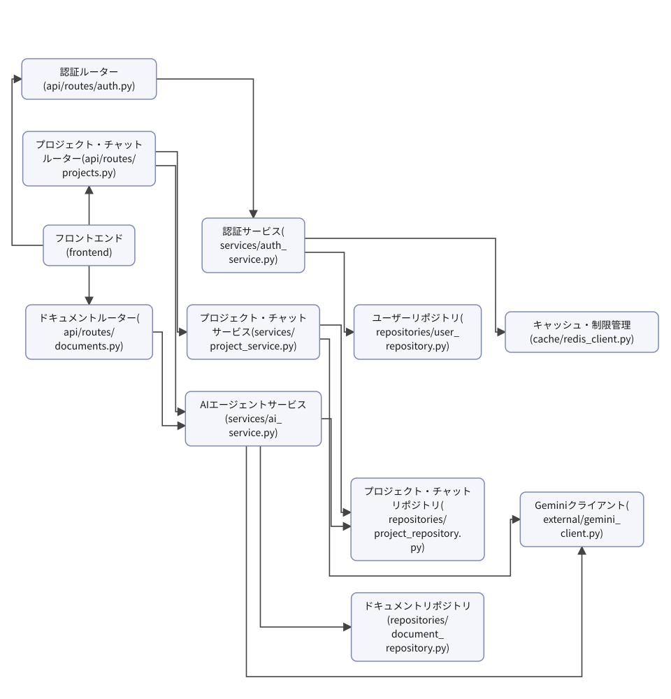

# 詳細設計書: Devex: AI との対話型チャットでユーザーのアイデアや要望をヒアリングし、「要件定義」「外部設計」「内部設計」「実装計画」の4種の Markdown 設計書を自動生成する Web アプリ。システム開発の初期フェーズで、ドキュメント作成の工数と属人化を減らしたい。

## 01 機能(処理)一覧

| 処理ID | 名称 | 種別 | トリガー | 関連画面 | 機能グループ | 概要 |
|---|---|---|---|---|---|---|
| F-01 | 新規ユーザー登録を行う | API | POST /api/v1/auth/signup | SCR-002 | auth | 新規ユーザーアカウントを作成する。 |
| F-02 | ログインを行う | API | POST /api/v1/auth/login | SCR-001 | auth | JWTアクセストークン発行およびリフレッシュトークンCookie設定を行う。 |
| F-03 | ログアウトを行う | API | POST /api/v1/auth/logout | SCR-003 | auth | トークンを無効化する。 |
| F-04 | プロジェクト一覧を取得する | API | GET /api/v1/projects | SCR-003 | projects | プロジェクト一覧を取得する。 |
| F-05 | プロジェクトを作成し参考資料をアップロードする | API | POST /api/v1/projects | SCR-004 | projects | プロジェクトを作成し、参考資料をアップロードする。 |
| F-06 | プロジェクト詳細を取得する | API | GET /api/v1/projects/{id} | SCR-005, SCR-006 | projects | プロジェクトの詳細情報を取得する。 |
| F-07 | チャットメッセージを送信する | API | POST /api/v1/projects/{id}/chat | SCR-005 | chat | チャットメッセージを送信し、SSEストリーミング応答を返す。 |
| F-08 | ヒアリング結果を承認し設計書生成をトリガーする | API+バッチ | POST /api/v1/projects/{id}/approve | SCR-005 | approve | ヒアリング結果の承認を受け付け、裏で設計書生成の非同期処理をトリガーする。 |
| F-09 | 生成された設計書一覧を取得する | API | GET /api/v1/projects/{id}/documents | SCR-006, SCR-007 | documents | 生成された4種の設計書一覧やバージョン一覧を取得する。 |
| F-10 | 特定の設計書内容と自己診断結果を取得する | API | GET /api/v1/projects/{id}/documents/{doc_id} | SCR-006 | documents | 特定の設計書内容および自己診断結果を取得する。 |
| F-11 | 設計書の自己診断を実行する | API | POST /api/v1/projects/{id}/documents/{doc_id}/diagnose | SCR-006 | documents | 設計書の自己診断を実行する。 |

## 02 データフロー

### データ辞書

| データ項目 | フィールド | 使う処理 |
|---|---|---|

### 処理概要表(入力 / 処理 / 出力)

| 処理ID | 名称 | 入力 | 処理内容 | 出力 |
|---|---|---|---|---|
| F-01 | 新規ユーザー登録を行う | ユーザー登録情報(メールアドレス、パスワード) | パスワードをハッシュ化し、新規ユーザーアカウントを作成してPostgreSQLに保存する。 | 登録完了メッセージ |
| F-02 | ログインを行う | ログイン資格情報(メールアドレス、パスワード) | 認証情報を検証し、JWTアクセストークンを発行するとともにリフレッシュトークンをHttpOnly Cookieに設定する。 | JWTアクセストークンおよびリフレッシュトークンCookie |
| F-03 | ログアウトを行う | ログアウト要求 | Redisを用いてトークンを無効化する。 | ログアウト完了メッセージ |
| F-04 | プロジェクト一覧を取得する | JWTアクセストークン | 認証状態を検証し、PostgreSQLからプロジェクトの一覧データを取得する。 | プロジェクト一覧 |
| F-05 | プロジェクトを作成し参考資料をアップロードする | プロジェクト情報、参考資料(txt/md/pdf、最大3件) | 参考資料を読み込んでテキストを抽出し、プロジェクトを作成してPostgreSQLに保存する。 | 作成されたプロジェクト情報 |
| F-06 | プロジェクト詳細を取得する | プロジェクトID(id) | プロジェクトIDをもとにPostgreSQLからプロジェクトの詳細情報を取得する。 | プロジェクト詳細情報 |
| F-07 | チャットメッセージを送信する | プロジェクトID(id)、チャットメッセージ | LangGraph制御のチャットメッセージ処理を実行し、SSEストリーミング応答を返す。 | SSEストリーミングによるチャット応答 |
| F-08 | ヒアリング結果を承認し設計書生成をトリガーする | プロジェクトID(id)、承認要求 | ヒアリング結果の承認を受け付け、裏で4種の設計書を逐次生成する非同期処理をトリガーする。 | 設計書生成トリガー受付完了メッセージ |
| F-09 | 生成された設計書一覧を取得する | プロジェクトID(id) | PostgreSQLから生成された4種の設計書一覧やバージョン一覧を取得する。 | 設計書一覧およびバージョン一覧 |
| F-10 | 特定の設計書内容と自己診断結果を取得する | プロジェクトID(id)、設計書ID(doc_id) | 指定された設計書内容およびAIによる自己診断結果を取得する。 | 設計書内容および自己診断結果 |
| F-11 | 設計書の自己診断を実行する | プロジェクトID(id)、設計書ID(doc_id) | AIを使用して設計書の自己診断を実行し、不足点を3段階で判定して結果を保存する。 | 自己診断結果 |

## 03 データモデル

### テーブル定義

### CRUD 図(処理 × テーブル)

| 処理ID | 名称 |
|---|---|

記号: 印なし = DFD の線から決まる R / `+` = 書き込みは DFD の線から決まり、C/U/D の区別は人が確定 / `*` = DFD に描いていない分で、人が確定

## 04 ソフトウェア構造

### モジュール一覧

| パス | 層 | 責務 | 主な依存先 | 関わる処理 |
|---|---|---|---|---|
| frontend | 入口 | Next.jsとTamaguiによる画面描画、プレビュー、操作インターフェースを提供する。 | api/routes/auth.py, api/routes/projects.py, api/routes/documents.py | F-01, F-02, F-03, F-04, F-05, F-06, F-07, F-08, F-09, F-10, F-11 |
| api/routes/auth.py | 入口 | サインアップ、ログイン、ログアウトのエンドポイント制御を行う。 | services/auth_service.py | F-01, F-02, F-03 |
| api/routes/projects.py | 入口 | プロジェクト管理、参考資料アップロード、チャット、承認のエンドポイント制御を行う。 | services/project_service.py, services/ai_service.py | F-04, F-05, F-06, F-07, F-08 |
| api/routes/documents.py | 入口 | 設計書の取得、自己診断実行のエンドポイント制御を行う。 | services/ai_service.py | F-09, F-10, F-11 |
| services/auth_service.py | ユースケース | JWT発行やパスワードハッシュ化などの認証ビジネスロジックを処理する。 | repositories/user_repository.py, cache/redis_client.py | F-01, F-02, F-03 |
| services/project_service.py | ユースケース | 参考資料のテキスト抽出、プロジェクト管理のビジネスロジックを実行する。 | repositories/project_repository.py, external/gemini_client.py | F-04, F-05, F-06 |
| services/ai_service.py | ユースケース | LangGraphによる対話制御、SSEストリーミング、4種設計書の逐次生成と自己診断の実行を行う。 | repositories/project_repository.py, repositories/document_repository.py, external/gemini_client.py | F-07, F-08, F-09, F-10, F-11 |
| repositories/user_repository.py | 永続化 | PostgreSQL上のユーザー情報の読み書きを行う。 | PostgreSQL | F-01, F-02 |
| repositories/project_repository.py | 永続化 | PostgreSQL上のプロジェクトおよびチャット履歴の読み書きを行う。 | PostgreSQL | F-04, F-05, F-06, F-07, F-08 |
| repositories/document_repository.py | 永続化 | PostgreSQL上の生成文書と自己診断結果（バージョン管理付き）の読み書きを行う。 | PostgreSQL | F-08, F-09, F-10, F-11 |
| cache/redis_client.py | 外部連携 | Redisによるレート制限およびトークン失効管理を行う。 | Redis | F-03 |
| external/gemini_client.py | 外部連携 | Gemini Flash-Lite APIとの通信およびPDFテキスト抽出を行う。 | Gemini Flash-Lite API | F-05, F-07, F-08, F-11 |

## 05 主要処理の手順

### 5.0 索引

| 処理ID | 名称 | トリガー | 選定理由 | 手順数 | 詳細(06) |
|---|---|---|---|---|---|
| F-07 | チャットメッセージを送信する | POST /api/v1/projects/{id}/chat | チャットメッセージを受信しLangGraphによるエージェント対話制御とSSEストリーミングによる逐次応答を行うため。 | 4 | L-01 |
| F-08 | ヒアリング結果を承認し設計書生成をトリガーする | POST /api/v1/projects/{id}/approve | ヒアリング結果の承認を受け付け、裏で非同期の設計書生成プロセスを安全にトリガーするため。 | 6 | — |

### 5.0.1 処理 × モジュール(セルは手順番号)

| 処理ID | api/routes/projects.py | services/project_service.py | services/ai_service.py | external/gemini_client.py |
|---|---|---|---|---|
| F-07 | 1 | — | 2 | 3 |
| F-08 | 2 | 3 | 4 | 5 |

### 5.1 F-07 チャットメッセージを送信する

トリガー: POST /api/v1/projects/{id}/chat

選定理由: チャットメッセージを受信しLangGraphによるエージェント対話制御とSSEストリーミングによる逐次応答を行うため。

| No | 呼び出し元 → 呼び出し先 | 関数 | 渡すデータ | 処理内容 | 結果 | DB 操作 | 分岐・例外 |
|---|---|---|---|---|---|---|---|
| 1 | frontend → api/routes/projects.py | post_chat | プロジェクトID(id), チャットメッセージ | チャットメッセージ送信リクエストを受け付ける | SSEストリーミングレスポンス | — | 3a へ |
| 1a | — | — | — | リクエストパラメータまたは認証の検証に失敗した場合 | ValidationError → 400 | — | — |
| 2 | api/routes/projects.py → services/ai_service.py | AIservice.stream_chat → 詳細: L-01 | プロジェクトID(id), チャットメッセージ | LangGraphによるチャットメッセージ処理とストリーミングの実行を依頼する | ストリーミングジェネレーター | — | — |
| 3 | services/ai_service.py → external/gemini_client.py | GeminiClient.invoke_lang_graph | チャットメッセージ, 過去の対話履歴 | LangGraph制御に基づくGemini Flash-Lite APIとの対話処理を実行する | 対話ストリーミングデータ | — | — |
| 4 | services/ai_service.py → frontend | — | SSEストリーミングデータ | 生成されたチャット応答をSSE形式でフロントエンドに返却する | SSEストリーミング応答 | — | — |

### 5.2 F-08 ヒアリング結果を承認し設計書生成をトリガーする

トリガー: POST /api/v1/projects/{id}/approve

選定理由: ヒアリング結果の承認を受け付け、裏で非同期の設計書生成プロセスを安全にトリガーするため。

| No | 呼び出し元 → 呼び出し先 | 関数 | 渡すデータ | 処理内容 | 結果 | DB 操作 | 分岐・例外 |
|---|---|---|---|---|---|---|---|
| 1 | 利用者 → frontend | — | プロジェクトID(id), 承認要求 | ヒアリング結果の承認ボタンを押下する | 承認APIリクエストの送信 | — | — |
| 2 | frontend → api/routes/projects.py | approve_project | プロジェクトID(id), 承認要求 | 承認エンドポイントへPOSTリクエストを送信する | 承認受付レスポンス | — | 1a へ |
| 2a | — | — | エラー情報 | バリデーションエラーまたはプロジェクトが存在しない場合 | 400 Bad Request または 404 Not Found | — | エラー応答を返却 |
| 3 | api/routes/projects.py → services/project_service.py | approve_project | プロジェクトID(id) | プロジェクトの承認処理とステータス更新を呼び出す | 更新済みプロジェクト情報 | projects U | — |
| 4 | services/project_service.py → services/ai_service.py | generate_documents_async | プロジェクトID(id) | 4種の設計書を逐次生成する非同期処理をトリガーする | トリガー完了 | — | — |
| 5 | services/ai_service.py → external/gemini_client.py | generate_documents | プロジェクトID(id) | Gemini Flash-Lite APIを使用して4種の設計書を逐次生成する | 生成された設計書データ | documents C | — |
| 6 | api/routes/projects.py → 利用者 | — | 設計書生成トリガー受付完了メッセージ | 設計書生成トリガー受付完了メッセージを返却する | 受付完了レスポンス | — | — |

## 06 処理ロジックの詳細

### 6.0 逆引き(関数 × 手順)

| L-ID | 関数 | モジュール | 呼ばれる手順 |
|---|---|---|---|
| L-01 | AIservice.stream_chat | services/ai_service.py | F-07#2 |

### 6.1 L-01 AIservice.stream_chat

呼ばれる手順: F-07#2

モジュール: services/ai_service.py

| 項目 | 内容 |
|---|---|
| シグネチャ | async def stream_chat(self, id: str, message: str) -> AsyncGenerator[str, None] |
| 引数 | id: プロジェクトID / message: チャットメッセージ |
| 戻り値 | SSEフォーマットに則ったストリーミングジェネレーター |
| 例外 | ValueError: プロジェクトが存在しない場合 / Exception: 外部サービスでのエラー時 |
| 事前条件 | プロジェクトIDが有効であり、かつ該当プロジェクトが存在すること |
| 事後条件 | LangGraphを通じた対話制御とSSEストリーミングが実行されること |

擬似フロー:

1. プロジェクトの存在確認を行う
    - project_repositoryを使用してプロジェクトIDを検証する
    - 存在しない場合はエラーを送出する
2. LangGraphによる対話制御のグラフを初期化する
    - document_repositoryから関連するドキュメントを取得する
    - グラフの状態を設定する
3. gemini_clientを呼び出してストリーミング処理の準備をする
    - チャットメッセージをクライアントに入力として渡す
4. SSEフォーマットに変換しながらレスポンスを順次生成する
    - 自己診断の結果や4種設計書の逐次生成データをストリームに含める

## 07 横断事項

| 項目 | 方針 | 関わるファイル(例) |
|---|---|---|
| 例外と HTTP | システム内で発生した例外は、APIの各エンドポイントにて一括してハンドリングし、適切なHTTPステータスコードに変換する。入力値の検証エラーは400 Bad Request、認証エラーは401 Unauthorized、リソースが見つからない場合は404 Not Found、予期せぬ内部エラーは500 Internal Server Errorを返却する。 | api/routes/auth.py, api/routes/projects.py, api/routes/documents.py |
| 認証 | 認証にはJWTを使用し、アクセストークンの有効期限は30分、リフレッシュトークンの有効期限は14日とする。リフレッシュトークンはHttpOnly Cookieに格納して安全に送信し、アクセストークンはAuthorizationヘッダーを通じて検証する。ログアウト時にはRedisを用いてトークンをブラックリストに追加し失効させる。 | services/auth_service.py, cache/redis_client.py |
| トランザクション | データベースへの書き込みおよび更新処理は、永続化層の各リポジトリでトランザクション管理を行う。サービス層におけるビジネスロジックの処理が正常に完了した段階で明示的に commit を実行し、例外発生時には確実に rollback を行うこと。 | repositories/user_repository.py, repositories/project_repository.py, repositories/document_repository.py |
| ログ | すべてのAPIリクエストおよびエラー発生時には、処理ID、タイムスタンプ、ユーザーID、エラーメッセージなどの詳細情報を構造化ログとして出力する。セキュリティ上の理由から、パスワードやJWTアクセストークンなどの機密情報はログに出力しないこと。 | api/routes/auth.py, api/routes/projects.py, api/routes/documents.py |
| レート制限 | APIの乱用を防ぐため、Redisを活用してリクエストのレート制限（Rate Limiting）を実装する。一定時間内に許容される最大リクエスト数を超過したアクセスに対しては、429 Too Many Requestsを返却する。 | cache/redis_client.py |
| 外部サービスの呼び出し | Gemini Flash-Lite APIなどの外部サービスとの通信では、ネットワークタイムアウトやレートリミット超過などの一時的な障害を考慮し、適切な例外処理およびリトライの方針を適用する。 | external/gemini_client.py |
