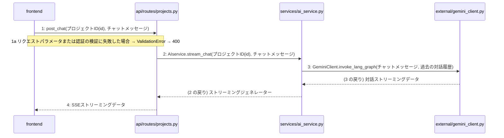

# M-03-T01 チャットメッセージを送信する

> 見本([README](../README.md))。本実装では、この単位だけを LLM に1回生成させる。入力は、この単位が参照する設計の該当箇所だけ(決定10)。
> 種別: 機能 / マイルストーン: M-03 AI対話ヒアリングとSSEストリーミングの実装 / 依存: M-02-T03

## 目的

利用者が SCR-005 でメッセージを送ると、AI の応答が SSE で少しずつ表示されるようにする。

## 対象の処理・参照する設計

- 処理: F-07 チャットメッセージを送信する(`POST /api/v1/projects/{id}/chat`)
- 手順: F-07#1〜#4(段階5)
- 関数の詳細: L-01 `AIservice.stream_chat`(段階6)
- モジュール: 段階4 `repositories/project_repository.py`・`external/gemini_client.py`・`services/ai_service.py`・`api/routes/projects.py`・`frontend`
- データ: (段階3にテーブルが無い ── 未定義を参照)
- 横断事項: 07章 例外と HTTP・認証・外部サービスの呼び出し・レート制限
- 画面: SCR-005

### シーケンス図(段階5 F-07 の手順から導出)

> 本実装では、段階5の手順の表から決定論的に導く(Phase 25-5)。図は直さず、直すのは手順の表。破線は戻り、「(N の戻り)」は手順に無く推測した戻り。

- 検証 F-07#1: 分岐「3a へ」の行が無い
- 検証 F-07#4: 呼び出し先 frontend は呼び出し元の側にいる。戻りを呼び出しとして書いているので、戻りとして描いた

図とテスト観点の突き合わせ: TC-01 の SUT `AIservice.stream_chat` から呼ぶ先は `external/gemini_client.py` だけで、スタブの欄の `project_repository` は手順に無い(段階6 L-01 の疑似コードにだけ出てくる)。チャット履歴の保存(未定義の最重要1件目)と同じ穴で、手順の表に足りない行がある。

## 作成・変更するファイル(依存順)

| ファイル | 責務 | 根拠 |
|---|---|---|
| `repositories/project_repository.py` | プロジェクトの存在確認と、チャット履歴の読み書き | 段階4。L-01 疑似コード1 |
| `external/gemini_client.py` | Gemini とのストリーミングの対話 | 段階4。F-07#3 |
| `services/ai_service.py` | `AIservice.stream_chat`: 存在確認 → 対話 → SSE の形に変えて順に返す | L-01 |
| `api/routes/projects.py` | `POST /api/v1/projects/{id}/chat`: 検証して `stream_chat` を呼び、SSE で返す | F-07#1・#2 |
| `frontend` | SCR-005 の送信と、応答の逐次表示 | 段階4(ファイルが決まらない ── 未定義を参照) |
| `tests/unit/test_ai_service_stream_chat.py` | `stream_chat` の単体テスト | 手順書で決める |
| `tests/integration/test_chat_api.py` | チャット API の結合テスト | 手順書で決める |
| `frontend/…/__tests__/` | SCR-005 の送信と表示のテスト | 手順書で決める(場所は `frontend` が決まってから) |

## 実装の要点(設計に書いていないことだけ)

- 依存されるものから作る: リポジトリ・外部連携 → サービス → ルート → 画面。サービスまでは単体テストで確かめられるので、ルートと画面より先に終える。
- 認証済みの利用者を得る部品は、M-01-T03 で作ったものを使う(既存の部品の再利用)。

## テスト観点

| # | 観点 | SUT | ドライバ | スタブ |
|---|---|---|---|---|
| TC-01 | 応答が SSE の形で順に返る | `AIservice.stream_chat` | 単体テスト(pytest) | `GeminiClient` をフェイク(決まったチャンクを返す)、`project_repository` をフェイク。外部 API と DB に依存せず、変換の順序だけを見るため |
| TC-02 | 無いプロジェクトでは例外になる | `AIservice.stream_chat` | 単体テスト(pytest) | TC-01 と同じ |
| TC-03 | API が `text/event-stream` で応答する | `POST /api/v1/projects/{id}/chat` | 結合テスト(httpx の AsyncClient) | `GeminiClient` だけをフェイク。外部 API を呼ばないため。DB は本物(テスト用) |
| TC-04 | 送信すると応答が少しずつ表示される | SCR-005 のチャット | 画面のテスト(vitest + Testing Library) | SSE の受信をモック。バックエンドに依存しないため |

- TC-01: Given 存在するプロジェクト / When `stream_chat(id, "こんにちは")` / Then フェイクのチャンクが、SSE の `data:` 行として同じ順に出る。
- TC-02: Given 無いプロジェクト / When `stream_chat` / Then `ValueError`(L-01 の例外)。
- 途中で失敗したときと、他人のプロジェクトのときのテストは、未定義が決まってから足す。

## 確認方法

- 上の単体・結合・画面のテストが通る。
- 開発環境で SCR-005 を開き、メッセージを送ると応答が少しずつ表示される。

## 未定義・要決定

| 重要度 | 出どころ | 対象 | 内容 |
|---|---|---|---|
| 最重要 | AI | F-07#1〜#4 / 段階4 `repositories/project_repository.py` | チャット履歴を、いつ(送信時・応答の完了時)、どのテーブルに保存するかが無い。要件定義 Must に「チャット履歴…DB保存」があり、段階4の責務にもあるが、手順に DB 操作が無い |
| 最重要 | AI | 07章 例外と HTTP / F-07#4 | ストリーミングの途中で外部サービスが失敗したときの応答が無い。07章はステータスで返す前提だが、SSE はヘッダを送った後なのでステータスを変えられない |
| 最重要 | AI | F-07#1 / 07章 認証 | 他人のプロジェクトにメッセージを送ったときの扱い(認可)が無い |
| 中程度 | 検証 | F-07#4 | 呼び出し先 `frontend` が、呼び出し元 `services/ai_service.py` の依存先に無い(層の飛び越し)。応答はルートが返す形に直すか |
| 中程度 | 検証 | F-07#1 | 分岐「3a へ」の行が無い(F-07 にあるのは 1a だけ)。どこへ分かれるのかを段階5で直す |
| 中程度 | AI | 段階4 `services/ai_service.py` / F-07#3 | LangGraph の制御をどこが持つかが食い違う。段階4では ai_service の責務、手順では `GeminiClient.invoke_lang_graph` |
| 中程度 | AI | L-01 疑似コード4 | 「自己診断の結果や4種設計書の逐次生成データをストリームに含める」は F-08 の責務に見える |
| 軽微 | AI | 07章 レート制限 | チャットの送信をレート制限の対象にするかが無い |
