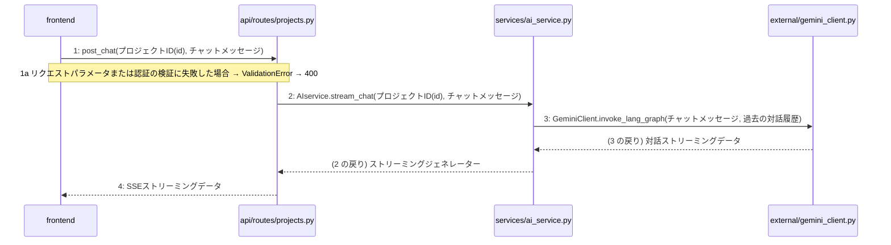

<!-- 見本(../../README.md)。本実装では、単位の手順書と参照する設計から決定論的に組み立てる(決定6)。画面の「AI 向けにコピー」も同じ中身。 -->

> ⚠ この単位には「未定義・要決定」が 8 件残っています(最重要 3 件)。決めてから渡すことを勧めます。

あなたは実装担当者です。以下の設計情報に従って実装してください。

## プロジェクト概要

段階7のマイルストーン M-01〜M-04 を実装する。今回はそのうち、M-03(AI対話ヒアリングとSSEストリーミングの実装)の単位 M-03-T01 だけを扱う。

## 実装ルール

- 技術スタック: Python 3.13、FastAPI、Next.js (App Router) + Tamagui、PostgreSQL、Redis、Docker Compose、pytest。
- 層は 入口 → ユースケース → 永続化 / 外部連携 の向きにだけ依存する。
- ルート(`api/routes/*`)は、リポジトリ・外部連携を直接呼ばない。
- 例外は各エンドポイントで一括して HTTP に変換する。入力 400 / 認証 401 / 無い 404 / 想定外 500。
- 書き込みはリポジトリでトランザクションを管理し、サービスの処理が成功したら commit、例外なら rollback。
- パスワード・トークンをログに出さない。
- 外部サービスの呼び出しは、タイムアウトとレート制限を考えて例外処理とリトライを行う。

## 今回の実装単位

M-03-T01 チャットメッセージを送信する(処理 F-07、`POST /api/v1/projects/{id}/chat`)

目的: 利用者が SCR-005 でメッセージを送ると、AI の応答が SSE で少しずつ表示されるようにする。

前提: M-02-T03(プロジェクト詳細を取得する)まで実装済み。

## 作成・変更するファイル(依存順)

| ファイル | 責務 |
|---|---|
| `repositories/project_repository.py` | プロジェクトの存在確認と、チャット履歴の読み書き |
| `external/gemini_client.py` | Gemini とのストリーミングの対話 |
| `services/ai_service.py` | `AIservice.stream_chat`: 存在確認 → 対話 → SSE の形に変えて順に返す |
| `api/routes/projects.py` | `POST /api/v1/projects/{id}/chat`: 検証して `stream_chat` を呼び、SSE で返す |
| `frontend` | SCR-005 の送信と、応答の逐次表示 |
| `tests/unit/test_ai_service_stream_chat.py` | `stream_chat` の単体テスト |
| `tests/integration/test_chat_api.py` | チャット API の結合テスト |

実装の要点:
- 依存されるものから作る: リポジトリ・外部連携 → サービス → ルート → 画面。
- 認証済みの利用者を得る部品は、M-01-T03 で作ったものを使う。

## 参照する設計

### 段階5 F-07 チャットメッセージを送信する

| No | 呼び出し元 → 呼び出し先 | 関数 | 渡すデータ | 処理内容 | 結果 | DB 操作 | 分岐・例外 |
|---|---|---|---|---|---|---|---|
| 1 | frontend → api/routes/projects.py | post_chat | プロジェクトID(id), チャットメッセージ | チャットメッセージ送信リクエストを受け付ける | SSEストリーミングレスポンス | — | 3a へ |
| 1a | — | — | — | リクエストパラメータまたは認証の検証に失敗した場合 | ValidationError → 400 | — | — |
| 2 | api/routes/projects.py → services/ai_service.py | AIservice.stream_chat | プロジェクトID(id), チャットメッセージ | LangGraphによるチャットメッセージ処理とストリーミングの実行を依頼する | ストリーミングジェネレーター | — | — |
| 3 | services/ai_service.py → external/gemini_client.py | GeminiClient.invoke_lang_graph | チャットメッセージ, 過去の対話履歴 | LangGraph制御に基づくGemini Flash-Lite APIとの対話処理を実行する | 対話ストリーミングデータ | — | — |
| 4 | services/ai_service.py → frontend | — | SSEストリーミングデータ | 生成されたチャット応答をSSE形式でフロントエンドに返却する | SSEストリーミング応答 | — | — |

### 段階6 L-01 AIservice.stream_chat(`services/ai_service.py`)

| 項目 | 内容 |
|---|---|
| シグネチャ | `async def stream_chat(self, id: str, message: str) -> AsyncGenerator[str, None]` |
| 引数 | id: プロジェクトID / message: チャットメッセージ |
| 戻り値 | SSEフォーマットに則ったストリーミングジェネレーター |
| 例外 | ValueError: プロジェクトが存在しない場合 / Exception: 外部サービスでのエラー時 |
| 事前条件 | プロジェクトIDが有効であり、かつ該当プロジェクトが存在すること |
| 事後条件 | LangGraphを通じた対話制御とSSEストリーミングが実行されること |

1. プロジェクトの存在確認を行う
    - project_repositoryを使用してプロジェクトIDを検証する
    - 存在しない場合はエラーを送出する
2. LangGraphによる対話制御のグラフを初期化する
    - document_repositoryから関連するドキュメントを取得する
    - グラフの状態を設定する
3. gemini_clientを呼び出してストリーミング処理の準備をする
    - チャットメッセージをクライアントに入力として渡す
4. SSEフォーマットに変換しながらレスポンスを順次生成する
    - 自己診断の結果や4種設計書の逐次生成データをストリームに含める

### シーケンス図(段階5 F-07 の手順から導出)

- 検証 F-07#1: 分岐「3a へ」の行が無い
- 検証 F-07#4: 呼び出し先 frontend は呼び出し元の側にいる。戻りを呼び出しとして書いているので、戻りとして描いた

### 段階4 モジュール(この単位で触るもの)

| パス | 層 | 責務 | 依存先 |
|---|---|---|---|
| repositories/project_repository.py | 永続化 | PostgreSQL上のプロジェクトおよびチャット履歴の読み書きを行う。 | PostgreSQL |
| external/gemini_client.py | 外部連携 | Gemini Flash-Lite APIとの通信およびPDFテキスト抽出を行う | Gemini Flash-Lite API |
| services/ai_service.py | ユースケース | LangGraphによる対話制御、SSEストリーミング、4種設計書の逐次生成と自己診断の実行を行う。 | repositories/project_repository.py, repositories/document_repository.py, external/gemini_client.py |
| api/routes/projects.py | 入口 | プロジェクト管理、参考資料アップロード、チャット、承認のエンドポイント制御を行う | services/project_service.py, services/ai_service.py |
| frontend | 入口 | Next.jsとTamaguiによる画面描画、プレビュー、操作インターフェースを提供する。 | api/routes/auth.py, api/routes/projects.py, api/routes/documents.py |

### 07章 横断事項(この単位に関わるもの)

- **例外と HTTP**: システム内で発生した例外は、APIの各エンドポイントにて一括してハンドリングし、適切なHTTPステータスコードに変換する。入力値の検証エラーは400 Bad Request、認証エラーは401 Unauthorized、リソースが見つからない場合は404 Not Found、予期せぬ内部エラーは500 Internal Server Errorを返却する。
- **認証**: 認証にはJWTを使用し、アクセストークンの有効期限は30分、リフレッシュトークンの有効期限は14日とする。(以下略)
- **外部サービスの呼び出し**: Gemini Flash-Lite APIなどの外部サービスとの通信では、ネットワークタイムアウトやレートリミット超過などの一時的な障害を考慮し、適切な例外処理およびリトライの方針を適用する。
- **レート制限**: APIの乱用を防ぐため、Redisを活用してリクエストのレート制限(Rate Limiting)を実装する。(以下略)

## テスト観点

| # | 観点 | SUT | ドライバ | スタブ |
|---|---|---|---|---|
| TC-01 | 応答が SSE の形で順に返る | `AIservice.stream_chat` | 単体テスト(pytest) | `GeminiClient`・`project_repository` をフェイク |
| TC-02 | 無いプロジェクトでは例外になる | `AIservice.stream_chat` | 単体テスト(pytest) | TC-01 と同じ |
| TC-03 | API が `text/event-stream` で応答する | `POST /api/v1/projects/{id}/chat` | 結合テスト(httpx) | `GeminiClient` だけをフェイク |
| TC-04 | 送信すると応答が少しずつ表示される | SCR-005 のチャット | 画面のテスト(vitest) | SSE の受信をモック |

## 完了条件

- この単位のテストが全件成功し、既存のテストが壊れていない。
- lint・型チェックが成功する。
- Docker Compose の環境で SCR-005 からメッセージを送ると、応答が少しずつ表示される。

## 未定義・要決定(決まるまで、推測で実装しないこと)

- [最重要] チャット履歴を、いつ・どのテーブルに保存するかが無い。
- [最重要] ストリーミングの途中で外部サービスが失敗したときの応答が無い。
- [最重要] 他人のプロジェクトにメッセージを送ったときの扱い(認可)が無い。
- [中程度] 呼び出し先 `frontend` が、`services/ai_service.py` の依存先に無い(層の飛び越し)。
- [中程度] 分岐「3a へ」の行が無い。
- [中程度] LangGraph の制御をどこが持つかが、段階4と段階5で食い違う。
- [中程度] L-01 疑似コード4 に F-08 の責務が混ざっている。
- [軽微] チャットの送信をレート制限の対象にするかが無い。

## 制約

- 既存の API を変更しない。
- 設計に無いことを推測で決めない。

まず現在のリポジトリを調査し、既存実装との整合性を確認してください。不整合がある場合は実装せず、問題点を報告してください。
